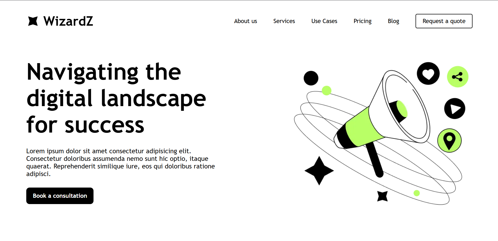

# 🌐 Pinterest-Inspired Website  

## 📌 Description:
A modern, Pinterest-inspired website featuring a sleek UI design, and smooth hover effects. Built using HTML, CSS, and JavaScript, this project replicates the aesthetics of Pinterest while maintaining a unique touch.

✨ Features:
✅ Clean and modern UI design
✅ Smooth hover animations
✅ Lightweight and fast performance 

## 🔧 Technologies Used  
- 🟠 **HTML5** – Page structure  
- 🔵 **CSS3** – Styling (Flexbox)  
- 🟢 **JavaScript** – Interactivity (Animations)

## 📷 Screenshot  
  

## 🚀 Live Demo  
🔗 [View Website Here](https://aadi-si.github.io/Modern-web-ui/)  

